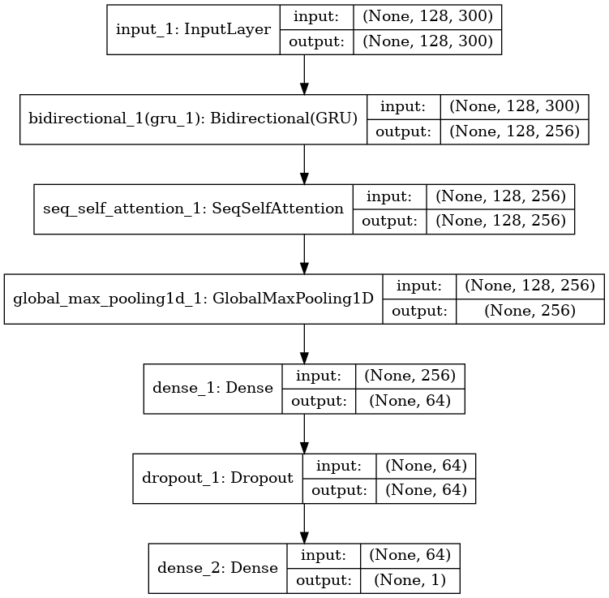
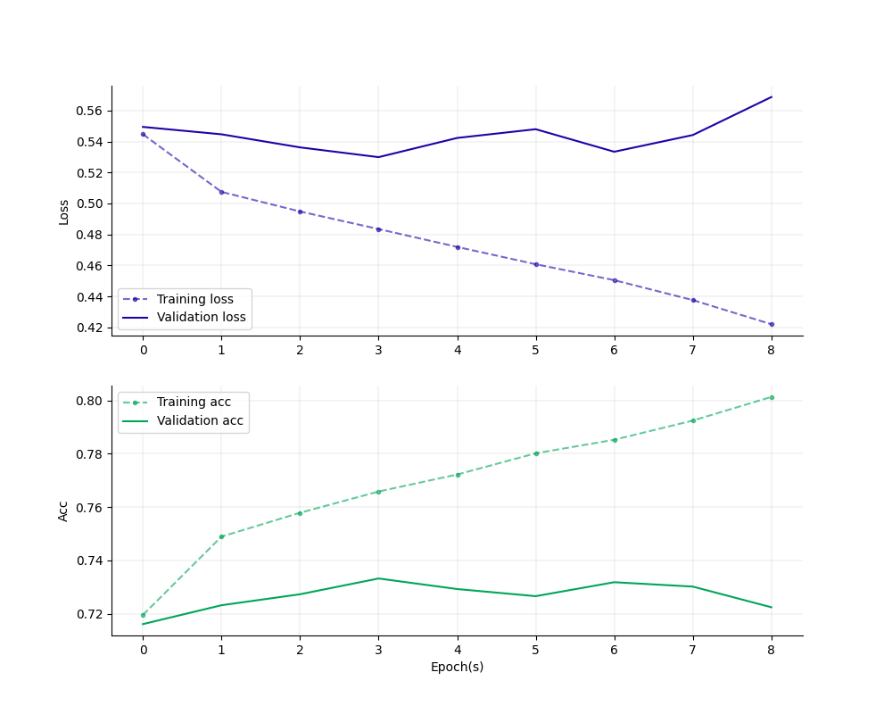

# GURA: GRU Unit for Recognizing Affect



GURA, short for GRU Unit for Recognizing Affect, is a simply sentiment analysis model that leverages the power of `Bidirectional GRU` and `Self-attention` mechanisms.

## Dataset

You can get the dataset from Hugging Face.

```bash
# Make sure you have git-lfs installed (https://git-lfs.com)
git lfs install
git clone --depth=1 git@hf.co:datasets/NatLee/sentiment-classification-dataset-bundle ./data
```

### Details

- `myanimelist-sts`: This dataset is derived from MyAnimeList, a social networking and cataloging service for anime and manga fans. The dataset typically includes user reviews with ratings. We used [skip-thoughts](https://pypi.org/project/skip-thoughts/) to summarize them. You can find the original source of the dataset [myanimelist-comment-dataset](https://www.kaggle.com/datasets/natlee/myanimelist-comment-dataset) and the version is `2023-05-11`.

- `aclImdb`: The ACL IMDB dataset is a large movie review dataset collected for sentiment analysis tasks. It contains 50,000 highly polar movie reviews, divided evenly into 25,000 training and 25,000 test sets. Each set includes an equal number of positive and negative reviews. The source is from [sentiment](https://ai.stanford.edu/~amaas/data/sentiment/)

- `MR`: Movie Review Data (MR) is a dataset that contains 5,331 positive and 5,331 negative processed sentences/lines. This dataset is suitable for binary sentiment classification tasks, and it's a good starting point for text classification models. You can find the source [movie-review-data](http://www.cs.cornell.edu/people/pabo/movie-review-data/) and the section is `Sentiment scale datasets`.

- `MPQA`: The Multi-Perspective Question Answering (MPQA) dataset is a resource for opinion detection and sentiment analysis research. It consists of news articles from a wide variety of sources annotated for opinions and other private states. You can get the source from [MPQA](https://mpqa.cs.pitt.edu/)

- `SST2`: The Stanford Sentiment Treebank version 2 (SST2) is a popular benchmark for sentence-level sentiment analysis. It includes movie review sentences with corresponding sentiment labels (positive or negative). You can obtain the dataset from [SST2](https://huggingface.co/datasets/sst2)

- `SUBJ`: The Subjectivity dataset is used for sentiment analysis research. It consists of 5000 subjective and 5000 objective processed sentences, which can help a model to distinguish between subjective and objective (factual) statements. You can find the source [movie-review-data](http://www.cs.cornell.edu/people/pabo/movie-review-data/) and the section is `Subjectivity datasets`.

## Usage

1. Build the image for this task

```bash
docker-compose build
```

2. Make tokenizer with your data in the folder `./data`.

    ```bash
    docker run --rm \
    --name sentiment-tokenizer \
    -v $(pwd)/src:/src \
    -v $(pwd)/data:/data \
    -v $(pwd)/model:/model \
    sentiment-image:latest \
    bash -c "python make-tokenizer.py"
    ```

3. Train the sentiment model.

    ```bash
    docker run --rm \
    --name sentiment-runner \
    -v $(pwd)/src:/src \
    -v $(pwd)/data:/data \
    -v $(pwd)/model:/model \
    sentiment-image:latest \
    bash -c "python main.py --mpqa"
    ```

    You can run with all dataset at once. Just change the last line to the following:
    ```bash
    python -i main.py --imdb --sst2 --mpqa --mr --subj --anime
    ```

4. (Optional) Make an auto-training for getting stable model in accuracy.

    ```bash
    docker run --rm \
    --name sentiment-runner \
    -v $(pwd)/src:/src \
    -v $(pwd)/data:/data \
    -v $(pwd)/model:/model \
    sentiment-image:latest \
    bash -c "python command.py"
    ```

5. (Optional) Evaluate and inference the model.
    ```bash
    docker run --rm \
    --name sentiment-evaluate \
    -v $(pwd)/src:/src \
    -v $(pwd)/data:/data \
    -v $(pwd)/model:/model \
    sentiment-image:latest \
    bash -c "python evaluate.py"
    ```

    You'll get matrices like this:
    ```
    2023-05-12 15:28:33.054 | INFO     | dataLoader:loadOfficialIMDB:128 - Load official IMDB data.
    2023-05-12 15:28:33.053 | INFO     | __main__:<module>:55 - Model file path -> /model/modelOurs/imdb-epoch_0003-acc_0.7628-valAcc_0.7310.h5
     2048/25000 [=>............................] - ETA: 4s
    ...
    25000/25000 [==============================] - 56s 2ms/step
    2023-05-12 15:29:40.376 | INFO     | __main__:predict:50 - 0.73096
    2023-05-12 15:29:40.444 | INFO     | __main__:predict:51 -               precision    recall  f1-score   support

        Negative       0.73      0.72      0.73     12500
        Positive       0.73      0.74      0.73     12500

        accuracy                           0.73     25000
    macro avg       0.73      0.73      0.73     25000
    weighted avg       0.73      0.73      0.73     25000

    ```

## Result

When you successfully train the model with specified dataset, you cat get the plot in the `./model`.

- IMDB

    


## Contributor

<!-- ALL-CONTRIBUTORS-LIST:START - Do not remove or modify this section -->
<!-- prettier-ignore-start -->
<!-- markdownlint-disable -->
<table>
  <tbody>
    <tr>
      <td align="center"><a href="https://github.com/NatLee"><br /><sub><b>Nat Lee</b></sub></a></td>
    </tr>
  </tbody>
</table>

<!-- markdownlint-restore -->
<!-- prettier-ignore-end -->

<!-- ALL-CONTRIBUTORS-LIST:END -->